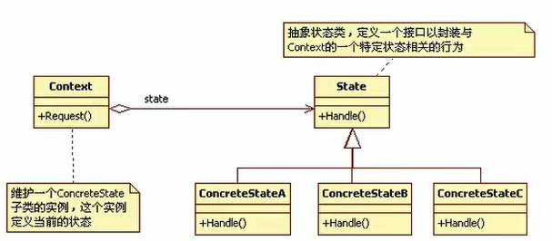

# 状态模式

> - 核心
>
>   > 用于解决系统中复杂对象的状态转换以及不同状态下行为的封装问题
>
> - 结构
>
>   > Context 环境类
>   >
>   > > 环境类中维护一个state对象，定义了当前的状态
>   >
>   > State抽象状态类
>   >
>   > ConcreteState具体状态类
>   >
>   > > 每一个类封装了一个状态对应的行为

